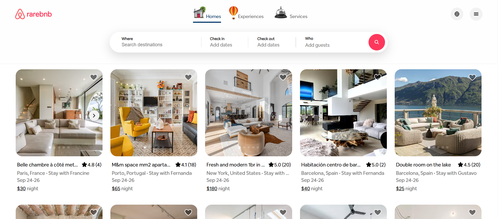
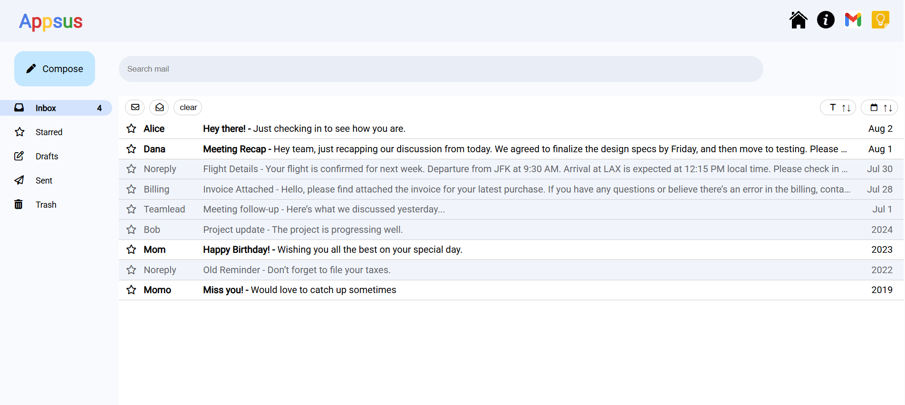

<h1 align="center">Hi👋 I'm Avihay!</h1>

## 👩‍💻About me:
I'm a Full Stack Developer. My journey began at Coding Academy, where I gained solid knowledge in both frontend and backend development. This comprehensive training laid the foundation for my skills in building modern web applications.

On the frontend, I work with JavaScript, HTML, and CSS, leveraging frameworks like React, Angular, and Vue. On the backend, I specialize in Node.js, REST APIs, and Sockets to develop reliable and scalable applications.

## 📌 Highlights:
<ul>
   <li>📚 Completed frontend and backend training at <b>Coding Academy</b>.</li>
   <li>⚡ Worked with <b>real-time communication technologies</b> like Sockets.</li>
   <li>📈 Continuously learning with a focus on impact and quality.</li>
</ul>

## 🌐 Socials:
 
 

## 💻 Tech Stack:
 
 
 
 
 
 
 

## 📂 Projects:

## 🏠 Rarebnb  
🔗 [Live Demo](https://rarebnb-qzpl.onrender.com/)  

  

---

## 📚 Appsus  
🔗 [Live Demo](https://didusha.github.io/Appsus/)  

  

## 📊 GitHub Stats:
 
 

---

